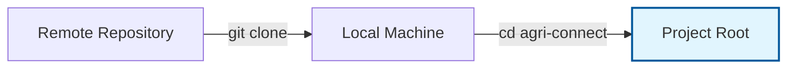
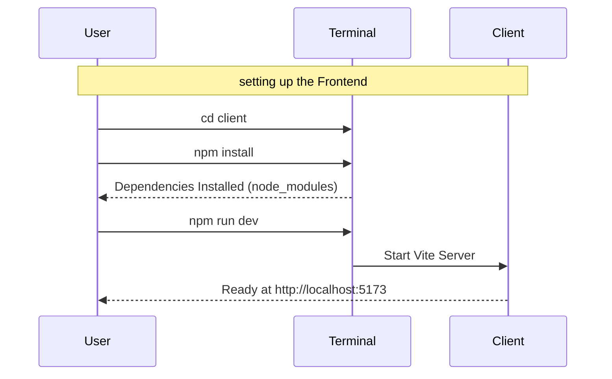
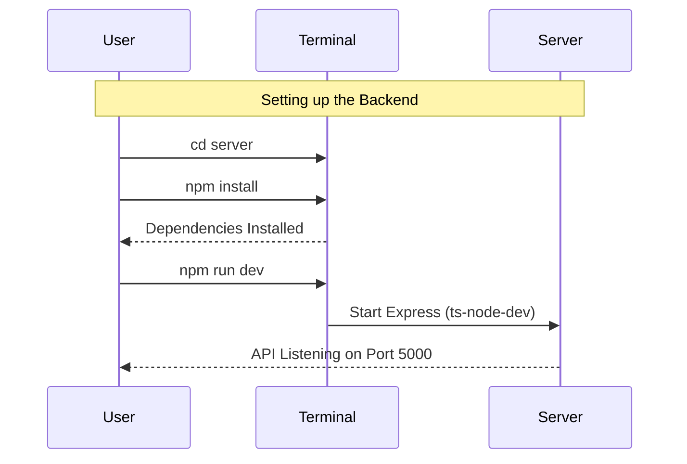
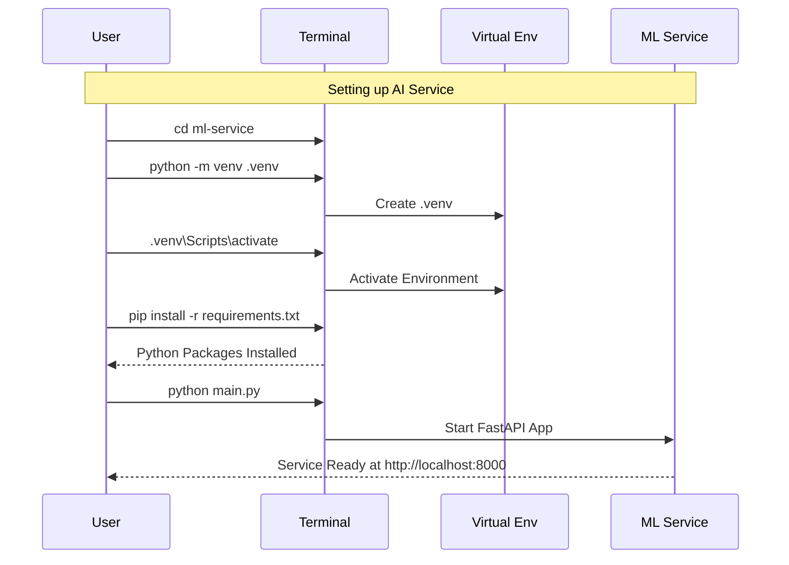

# Kisan-Mitra
# Agri-Connect / Kisan Mitra

This project is a comprehensive agricultural ecosystem featuring a Client (Frontend), Server (Backend API), and an ML Service for crop analysis.

***

## Getting Started

Follow the instructions below to set up and run each component of the application.

### Prerequisites
- **Node.js** (v18 or higher)
- **Python** (v3.9 or higher)
- **Git**

***

## 1. Clone the Repository

Start by cloning the repository to your local machine.

```bash
git clone <repository-url>
cd agri-connect
```



***

## 2. Client Setup (Frontend)

The client is a React application built with Vite and Tailwind CSS.

### Installation Commands

Navigate to the `client` folder and install the dependencies.

```bash
cd client
npm install
```

### Run Commands

Start the development server.

```bash
npm run dev
```
The application will typically run at `http://localhost:5173`.

### Visual Workflow



***

## 3. Server Setup (Backend)

The server is a Node.js & Express application using TypeScript.

### Installation Commands

Navigate to the `server` folder and install the dependencies.

```bash
cd server
npm install
```

### Run Commands

Start the backend server in development mode.

```bash
npm run dev
```
The server typically runs on port `5000` (e.g., `http://localhost:5000`).

### Visual Workflow



***

## 4. ML Service Setup (AI Engine)

The ML Service is a Python-based FastAPI application for image analysis.

### Installation Commands

Navigate to the `ml-service` directory. We recommend using a virtual environment.

**1. Create and Activate Virtual Environment**

*Windows:*
```bash
cd ml-service
python -m venv .venv
.venv\Scripts\activate
```

*Mac/Linux:*
```bash
cd ml-service
python3 -m venv .venv
source .venv/bin/activate
```

**2. Install Dependencies**

```bash
pip install -r requirements.txt
```

### Run Commands

Start the ML service.

```bash
# Make sure your virtual environment is activated
python main.py
```
Alternatively, you can run with uvicorn directly:
```bash
uvicorn main:app --reload --host 0.0.0.0 --port 8000
```
The service will run at `http://localhost:8000`.

### Visual Workflow



***

## Summary of Ports

| Service | Port | URL |
| :--- | :--- | :--- |
| **Client** | 5173 | `http://localhost:5173` |
| **Server** | 5000 | `http://localhost:5000` |
| **ML Service** | 8000 | `http://localhost:8000` |
